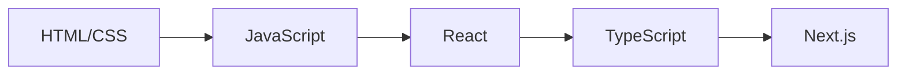

  
  
  <h3>Passionate about creating beautiful, functional web experiences</h3>

  

---

### 📬 Connect with me:

---

> *"Your time is limited, so don't waste it living someone else's life."* — Steve Jobs

---

## 💻 Tech Stack

### Front End Languages & Tools

### Front End Frameworks & Libraries

### UI/UX & Design Tools

### Build Tools & Package Managers

### Testing & Performance

### Version Control & Collaboration

### Tools & Platforms

---

## 📊 GitHub Analytics

  

  
  

---

## 🏆 GitHub Trophies

  

---

## 📈 Contribution Graph

  

this is good or we can add some things

## 📅 Development Journey

## 🚀 Featured Projects

  
| Project | Description | Tech Stack | Live Demo |
|---------|-------------|------------|-----------|
| **[Wheather App]** |Simple App To Hnow The Weather In All The World | Html , js , Bootstrab | [🔗 Live](https://app-of-weather.vercel.app/) |
| **[What For Dinner]** | Choose The Best Meal For Today | Html , js , Bootstrab | [🔗 Live](https://whatfor-dinner-pied.vercel.app/) |
| **[Profile To Ahmed Hassan]** |powerful Profile |  Html , js , Bootstrab ,css | [🔗 Live](https://profile-ahmed-hassen.vercel.app/) |

## ☕ Support Me

If you find my work helpful, consider supporting me:
 

## 💡 Fun Fact

I enjoy combining **coding with creativity**, making software that is both **functional and visually appealing**.

---

### 💬 Random Dev Quote

---

